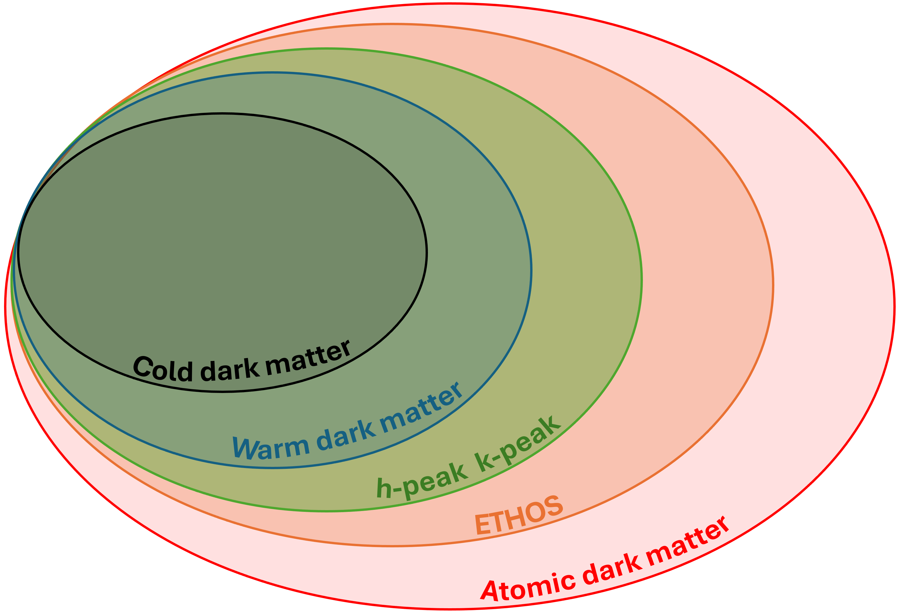

.. _dark_matter_models:

Dark matter models
==================

The simulations of the DREAMS project have been run using five different dark matter models. The scheme belows show the different dark matter models we consider together with their relationship. For instance, the cold dark matter, warm dark matter, and :math:`h_{\rm p}-k_{\rm p}` models are subclasses of the ETHOS models, that is more general than all those. 

   

Cold dark matter
~~~~~~~~~~~~~~~~

Cold dark matter is the simplest model we consider and it is the model assumed in the standard model of cosmology :math:`\Lambda {\rm CDM}`. This model assumes that dark matter only interacts gravitationally with itself and with baryons and have negligible thermal velocities on all scales at all redshifts of interest. In this case, dark matter can be represented as a collisionless and pressureless fluid in the numerical simulations.

Note that this model do not have any free parameters. We will refer to this model as either Cold dark matter or CDM.

Warm dark matter
~~~~~~~~~~~~~~~~

Warm dark matter (WDM) is perhaps the simplest extension to CDM. These models consider that dark matter was in thermal equilibrium in the early Universe. Due to the expansion of the Universe, dark matter interactions became inefficient and its thermal distribution was frozen. Candidates for WDM include sterile neutrinos. In the model we use, we only have one free parameter, the WDM mass, :math:`M_{\rm WDM}`. This parameter fully characterizes the distribution of the WDM thermal velocities (which is described by the Fermi-Dirac distribution).

We implement these models in the simulations by assuming that WDM is a collisionless and pressureless fluid (in the same way as CDM). The only difference is that when we generate the initial conditions, we need to account for the impact of WDM mass on the linear power spectrum, that can be described as (`Bode et al. 2001 <https://ui.adsabs.harvard.edu/abs/2001ApJ...556...93B/abstract>`_)

.. math::

   P_{\rm WDM}(k)=\beta(k)P_{\rm CDM}(k)~,

where 

.. math::

       \beta(k) &= \left[ \left( 1 + (\alpha k)^{2.4} \right)^{-5.0/1.2} \right]^2 \\
    \alpha &= 0.048 \left(\frac{M_{\rm WDM}}{1~\mathrm{keV}}\right)^{-1.15} \left( \frac{\Omega_{\rm m} - \Omega_{\rm b}}{0.4} \right)^{0.15} \left(\frac{h}{0.65} \right)^{1.3}  ~.

.. Note::

   In our simulations we do not assign thermal velocities to the WDM particles. See `Leo et al. 2017 <https://ui.adsabs.harvard.edu/abs/2017JCAP...11..017L/abstract>`_ for a justification.

We emphasize that cold dark matter is contained in these models: cold dark matter can be recovered by taking large WDM masses. 

Hpeak - Kpeak and ETHOS
~~~~~~~~~~~~~~~~~~~~~~~

While WDM is characterized by a single scale below which structure is strongly suppressed, more complex dark matter sectors could lead to matter power spectra with a richer shape characterized by multiple scales (see e.g. `Boehm and Schaeffer 2005 <http://dx.doi.org/10.1051/0004-6361:20042238>`_). In particular, the presence of light (relativistic) degrees of freedom coupling to dark matter in the early Universe can lead to dark sound waves propagating in the dark sector, leading to acoustic oscillations being imprinted on the matter power spectrum. Such “dark acoustic oscillations” (DAOs, `Cyr-Racine et al. (2014) <http://dx.doi.org/10.1103/PhysRevD.89.063517>`_) do not generally extend to arbitrarily small scales (large k) since the coupling between dark matter and the relativistic species is finite, leading to dissipation of the sound waves and a net suppression of the matter power spectrum on small scales . Therefore, such dark matter models are typically characterized by at least two parameters: a sound horizon scale and a damping scale (`Buckley et al. (2014) <http://dx.doi.org/10.1103/PhysRevD.90.043524>`_).

A convenient and simple parameterization for such a matter power spectrum is the so-called :math:`k_{\rm peak}, h_{\rm peak}` approach (`Bohr et al. 2020 <https://doi.org/10.1093/mnras/staa2579>`_). Here, :math:`k_{\rm peak}` represents the Fourier wavenumber of the first (largest scale) acoustic oscillation in the matter power spectrum, while :math:`h_{\rm peak}` represents the height of this first acoustic peak relative to what the power spectrum would have been in the CDM case, i.e. :math:`h_{\rm peak} = P_{\rm DAO}(k_{\rm peak})/P_{\rm CDM}(k_{\rm peak})`. With these choices, :math:`k_{\rm peak}` is closely related to the dark matter sound horizon, while :math:`h_{\rm peak}` captures the amount of acoustic dissipation in the dark sector. For instance, :math:`h_{\rm peak} = 1` corresponds to relatively undamped DAOs in the matter power spectrum and :math:`h_{\rm peak} \to 0` corresponds to strongly damped DAOs. This approach is powerful as it provides a parameterization that can smoothly interpolate between WDM (corresponding to :math:`h_{\rm peak} \to 0`) and CDM (:math:`k_{\rm peak}\to \infty`), allowing one to consider a more diverse range of matter power spectrum shapes than either CDM or WDM.
Extended dark sectors typically not only alter the initial matter power spectrum, but also allow for dark matter particles to exchange energy and momentum among themselves. Such self-interacting dark matter (`Spergel & Steinhardt 2000 <http://dx.doi.org/10.1103/PhysRevLett.84.3760>`_) can affect the density profiles of dark matter halos. This can greatly increase the diversity of halo profile types, ranging from those with a constant density core to very dense halos undergoing gravothermal collapse. In their simplest incarnation, self-interactions are elastic and simply redistribute the energy among dark matter particles. Generally speaking, the ability of a given particle model to affect the matter power spectrum and the self-interaction cross section is correlated. To self-consistenly capture this relationship, the Effective THeOry of Structure formation (ETHOS) was created (`Cyr-Racine et al. 2016 <https://doi.org/10.48550/arXiv.1512.05344>`_ , `Vogelsberger et al. 2016 <http://adsabs.harvard.edu/abs/2016MNRAS.460.1399V>`_). This allows for a joint and coherent understanding of the impacts of a non-CDM matter power spectrum and dark matter self-interaction on structure formation.

Atomic dark matter
~~~~~~~~~~~~~~~~~~

Atomic dark matter (ADM) covers a broad range of interacting dark matter models. In the simplest minimal model, ADM comprises a dark electron, a dark proton, and dark photon (without dark nuclear physics) and is described by five parameters: :math:`m_e’`, :math:`m_p’`, :math:`\alpha’`, :math:`f’`, and :math:`\xi’` where the first three parameters are the particle masses and the dark fine structure constant. :math:`f’` is the dark matter mass fraction of the ADM and :math:`\xi’` is the ratio of the dark CMB (cosmic microwave background) temperature to the Standard Model CMB temperature. Depending on the choice of particle parameters, the atomic dark matter could comprise all the dark matter (:math:`f’=100%`) or a fraction of it. If :math:`f'` is smaller than 1, the rest of the dark matter can be either cold, warm, self-interacting...etc. The atomic dark sector is assumed to be asymmetric, like the Standard Model.

In this minimal case, we implement ADM in hydrodynamical simulations as separate dark gas particles which convert into collisionless dark clumps when the dark gas becomes Jeans unstable. The atomic dark gas experiences dark pressure forces and dark cooling physics consistent with the ADM parameters chosen (`Roy et al. 2023 <https://arxiv.org/abs/2304.09878>`__). The remainder of the dark matter can either be modelled as cold dark matter (CDM) or as self-interacting dark matter (SIDM). Whilst the minimal atomic dark matter model comprises solely of an asymmetric dark sector with dark electromagnetic interactions, atomic dark matter can also encompass more complex dark sectors with dark nuclear physics and dark particle physics as rich as the Standard Model. Such models would have more than the five parameters of the minimal case and potentially as many parameters as the Standard Model (if not more).

Several other models of dark matter can be considered limiting cases of the ADM model. Since the ADM can experience pressure forces as a dark plasma in the early Universe (until dark recombination), the ADM can imprint dark acoustic oscillations (DAOs) and suppress the matter power spectrum, like the ETHOS, h-peak - k-peak and warm dark matter models listed above (see `Bansal et al. 2022 <https://arxiv.org/abs/2212.02487>`_, `Cyr-Racine & Sigurdson 2012 <https://arxiv.org/abs/1209.5752>`_). The ADM parameter space which produces DAOs, comprises large mass fractions and results in inefficient galactic cooling will encompass much of the parameter space of these models. However, the ADM model, as currently implemented, will not accurately capture purely elastic collisions between dark matter particles with large mean free paths (compared to simulation softening lengths).

