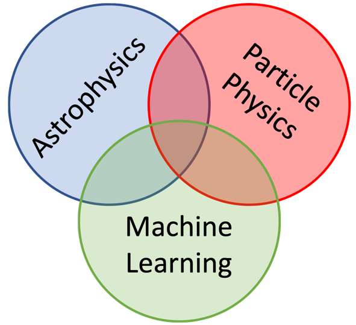

Goals
=====

The main goals of the DREAMS projects are:

- To shed light on the nature and properties of dark matter
- To understand the physics that governs the Universe on small scales

To accomplish these goals, DREAMS will run a very large set of state-of-the-art hydrodynamic simulations and explore them with machine learning. The simulations will explore different regimes, from cosmological boxes to dwarf galaxies, and will be run with different dark matter models while varying uncertain astrophysical processes such as the efficiency of supernova feedback.

