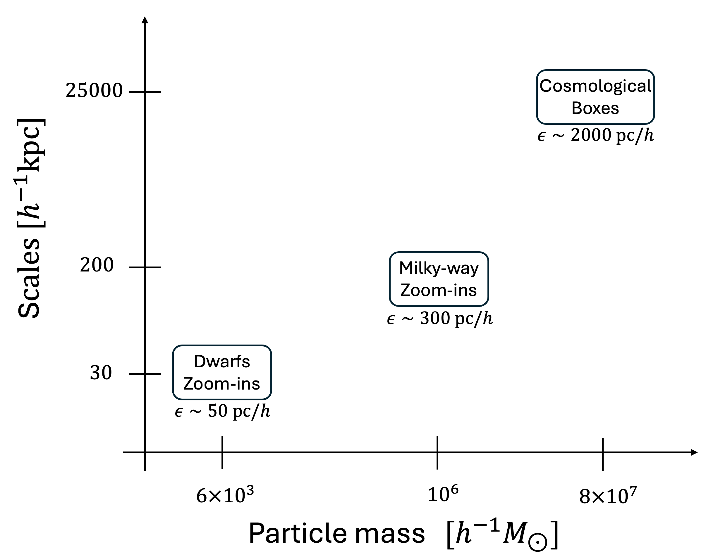

.. _types:

Simulation types
================

Ideally, we would like to have simulations covering a volume as large as possible (to enhance statistics) with the highest possible resolution (to better identify dark matter effects). Unfortunately, at a limited computing time, one needs to make a tradeoff between those. In DREAMS, we balance this by running simulations that cover different physical scales at different resolutions.

.. Important::

   In the quest of astrophysical signatures of dark matter properties we also face the challenge of choosing between large statistics at low-resolution versus low statistics at high-resolution.

The DREAMS simulations can then be classified into three categories, depending on the mass resolution, spatial resolution, and the environment they prove:

- Cosmological boxes
- Milky-way zoom-ins
- Dwarfs zoom-ins

Cosmological boxes
~~~~~~~~~~~~~~~~~~

These simulations follow the evolution of :math:`256^3` dark matter particles plus :math:`256^3` initial gas elements in a periodic comoving box of length :math:`25 ~h^{-1}{\rm Mpc}` from :math:`z=127` down to :math:`z=0`. 

The dark matter particle mass is (assuming fixed :math:`\Omega_{\rm b}=0.049`) :math:`7.81 \times 10^7 \times (\Omega_{\rm m}/0.302) ~h^{-1} M_\odot`. The softening length is roughly :math:`2~h^{-1}{\rm kpc}`.

Milky-way zoom-ins
~~~~~~~~~~~~~~~~~~

These simulations target individual dark matter halos with masses similar to the one of the Milky-Way at higher resolution than the cosmological boxes described above. These simulations are carried out as follows. First, we run a cosmological N-body simulation to follow the evolution of :math:`256^3` dark matter particles in a :math:`L=100~h^{-1}{\rm Mpc}` periodic box. From this low-resolution simulation, a random isolated dark matter halo with mass similar to the one of the Milky-Way (:math:`\sim1.6\times10^{12}~M_\odot`) is selected. Next, all particles within 5x the virial radius of this halos are traced back to :math:`z=127` and an ellipsoide is used to approximate that region in the initial conditions. That region is then sampled with intermediate resolution particles (500x lower mass) and a new simulation is run. This intermediate resolution simulation allows us to better define the boundary of the considered halo and do not add much to the computational cost. Finally, we take all particles (low resolution and intermediate resolution) within 5x the virial radius of the halo and fit an ellipse to their Lagrangian region. That region is then sampled with high-resolution particles (~8x lower mass than intermediate resolution particles), either dark matter only (for N-body) or dark matter plus gas (for hydrodynamic).

In these simulations, the dark matter particle mass is :math:`1.2 \times 10^6~h^{-1} M_\odot` and the gravitational softening length is set to roughly :math:`300~{\rm pc}`.

Dwarfs zoom-ins
~~~~~~~~~~~~~~~

These simulations target individual dark matter halos with masses :math:`\sim10^{10}~M_\odot` that could host individual dwarf galaxies. The procedure we employ to run these simulations is similar to the one described about for the MW-like halos but starting with a uniform box of :math:`35~h^{-1}M_\odot` and targetting isolated halos with mass :math:`10^{10}~M_\odot`.

In these simulations, the dark matter particle mass is :math:`6.53 \times 10^3~h^{-1} M_\odot` and the gravitational softening length is set to roughly :math:`50~{\rm pc}`.
